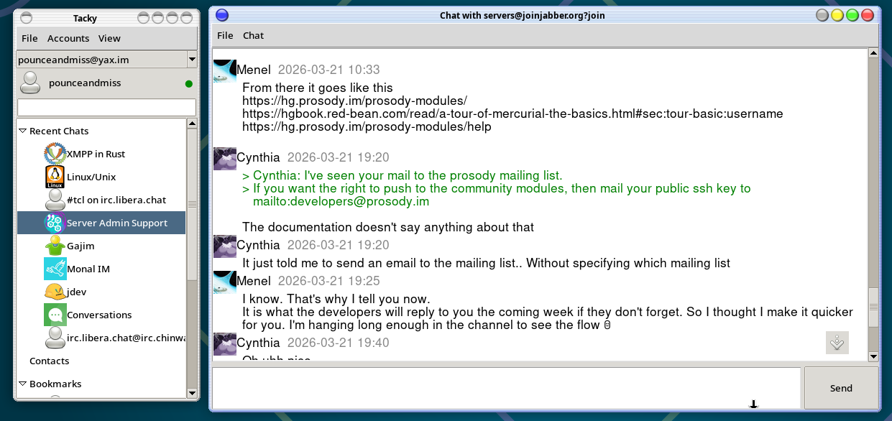
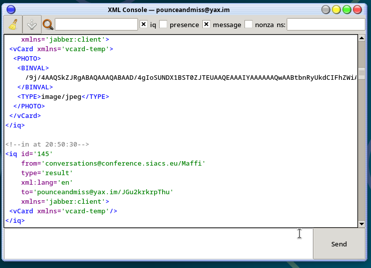

# Tacky

A desktop XMPP chat client built with Tcl/Tk. Pre-alpha.

## Screenshots





## Core ideas

- Portable backend aiming for a very high level api: libtacky doesn't just help you form and send stanzas, it aims to take care of all the business logic, local caching and settings storage, now also calls, etc. The gui should stay as simple as possible, only concerning itself with displaying stuff. All methods and events are routed through a bridge ready to transparently be called either in the same thread or a different process, or even a different language via JSON.
- Lightweight, tries to be easily distributable - self-contained statically-linked executable with all dependencies including calls at <20mb
- Advanced MAM handling: it's aware that the message history it has is not full. Lazy loads from server, aims to support server-side search.

## Requirements

- Tcl 9
- Tk
- tcllib
- tdom
- mtls
- sqlite3

## Running
If you have all the dependencies installed, call `./main.tcl`.
But you probably don't, so on Linux you should be able to just call "make", which will download and build all the dependencies for you, and package them all into a single executable with the client: `./tacky`. Still needs imagemagick installed to see avatars. Also needs some luck to launch as it hasn't been tested thoroughly at all.

You can have the backend run in a separate thread by calling `./main.tcl --backend threaded` - this will use slightly more RAM, but won't affect features. 

## Tests

```sh
./test_all.tcl
```

### Integration tests:

Run with an XMPP server for integration tests:

```sh
./tests/servers/with_prosody.sh ./test_all.tcl 
```
You need to have docker installed and running and have permissions. Run at your own risk - server scripts are entirely AI-generated and might screw up your system.
There's also a script for mongoose and ejabberd. 

## Architecture

```
GUI (gui/)  →  Event Router (tacky.tcl)  →  Backend (taco/)  →  XMPP
```

tacky.tcl is the middleman between backend and gui. It provides a publish/subscribe event system and forwards method calls to the backend. The gui calls `tacky` as if it were the backend directly — tacky routes everything transparently, whether in the same thread (`tacky_type`) or across threads (`tacky_threaded_type`). All methods are async. There's also `tackyd-json.tcl` that speaks the same "protocol" wrapped in length-prefixed json.