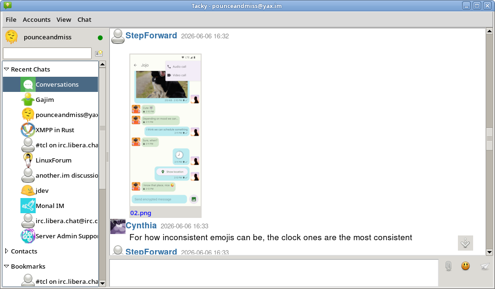
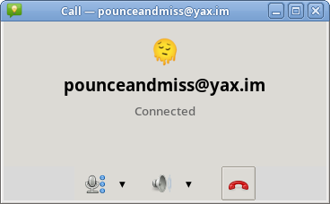

# Tacky

A desktop XMPP chat client built with Tcl/Tk. Pre-alpha.

## Screenshots





## Core ideas
- Portable backend aiming for a very high level api: libtacky doesn't just help you form and send stanzas, it aims to take care of all the business logic, local caching, settings, calls, etc. It is fully decoupled from gui, and offers a JSON api to be used from other languages.
- Lightweight, tries to be easily distributable - self-contained statically-linked executable with all dependencies including calls at ~15mb
- Advanced MAM handling: it's aware that the message history it has is not full. Lazy loads from server, aims to support server-side search.

## Alternative frontends

Because the backend is fully decoupled from the GUI and reachable over JSON, the same libtacky backend can drive completely different frontends. Two experimental ones exist - not ready to use, but ready to poke:

- [tacky_android](https://github.com/pounceandmiss/tacky_android) - an Android port
- [gacky](https://github.com/pounceandmiss/gacky) - a GTK frontend

## Key features support
- Modern calls compatible with Conversations and Dino
- OMEMO (only direct messages)
- Attachments

## Running

Download the executable from the releases page for Windows or Linux, click and run.
You can have the backend run in a separate thread by calling `tacky --backend threaded` - this will use slightly more RAM, but won't affect features.

## Building

### Linux
`make`

will download and build all the dependencies for you, and package them all into a single executable with the client: `./dist/tacky`.

`make linux`

will do the same in a debian docker 

### Windows
`make win`

on Linux will download and build all the dependencies for you, and package them all into a single cross-compiled executable with the client: `./dist/tacky.exe`.

### Run without building
If you have all the dependencies installed, call `wish ./bin/tacky.tcl`. You can get a `wish` with all dependencies easily: run `make wish` - result in `build/linux/wish`.


### Flatpak

Setup:

```sh
flatpak remote-add --if-not-exists --user flathub https://dl.flathub.org/repo/flathub.flatpakrepo
flatpak install --user flathub org.flatpak.Builder
```

Build, install and run (the runtime/SDK are pulled in on first build):

```sh
cd flatpak
flatpak run org.flatpak.Builder --user --install --install-deps-from=flathub --force-clean build-dir io.github.pounceandmiss.Tacky.yml
flatpak run io.github.pounceandmiss.Tacky
```

## C library

The backend can also be built as a self-contained static library and linked
straight into a native app, instead of shipped as an executable. 

```sh
make lib        # native   -> dist/libtacky.a
make win-lib    # MinGW/PE -> dist/libtacky-win.a
```

The result is one self-contained archive - the whole Tcl runtime, taco and every
dependency are merged in, so it links with no `--start-group`. It contains C++
(libdatachannel), so link the host app with `g++`, not `gcc`.

The C surface (`embed/tacky.h`) is just a pipe to the real API is taco's JSON
contract. Three functions and one callback:

```c
tacky *tacky_create(const char *const *taco_args,
                    tacky_emit_fn emit, void *ud);
void tacky_send(tacky *t, const char *json, size_t len);
void tacky_destroy(tacky *t);

typedef void (*tacky_emit_fn)(void *ud, const char *json, size_t len);
```

You send requests and receive replies and events as UTF-8 JSON:

- request: `["module","method",{args}]`, optionally with a token `[...,token]`
- reply: `["result",token,data]` or `["error",token,msg]`
- event: `["event",module,"<Event>",{args}]`

The `token` is an optional correlation id echoed back on the matching reply.

The emit callback fires on the backend thread, not the caller's: copy the bytes,
hand them to your own loop, return promptly, and don't re-enter tacky from
inside it. `tacky_send` is safe to call from any thread; create and destroy from
one owning thread.

## Tests

```
make test
```

## Architecture

```
GUI (gui/)  <->  tacky bridge (lib/libtacky/)  <->  Backend (lib/taco/)  ->  XMPP
```

The bridge supports three backend transport modes, all transparent to the GUI:
`--backend MODE    Backend mode: direct (default), thread, process`