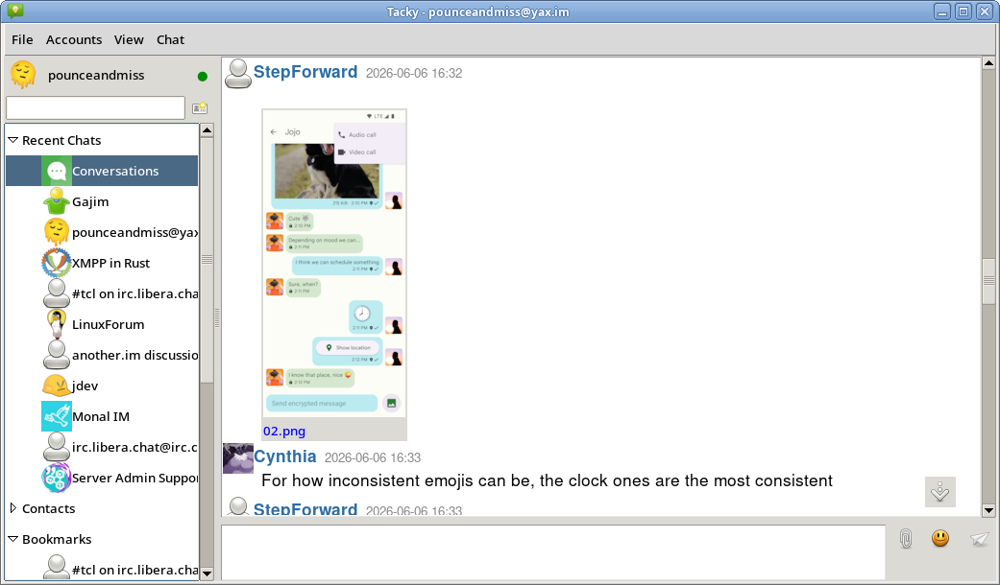
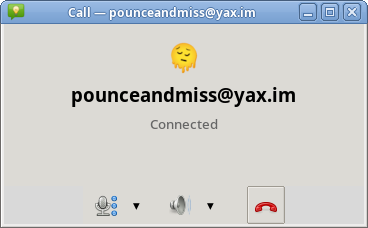

# Tacky

A desktop XMPP chat client built with Tcl/Tk. Pre-alpha.

## Screenshots





## Core ideas
- Portable backend aiming for a very high level api: libtacky doesn't just help you form and send stanzas, it aims to take care of all the business logic, local caching, settings, calls, etc. It is fully decoupled from gui, and offers a JSON api to be used from other languages.
- Lightweight, tries to be easily distributable - self-contained statically-linked executable with all dependencies including calls at ~15mb

## Alternative frontends

Because the backend is fully decoupled from the GUI and reachable over JSON, the same libtacky backend can drive completely different frontends. Two experimental ones exist - not ready to use, but ready to poke:

- [tacky_android](https://github.com/pounceandmiss/tacky_android) - an Android port
- [gacky](https://github.com/pounceandmiss/gacky) - a GTK frontend

## Key features support
- Modern calls compatible with Conversations and Dino
- OMEMO (only direct messages)
- Attachments

## Running

Download the executable from the releases page for Windows or Linux, click and run.
You can have the backend run in a separate thread by calling `tacky --backend threaded` - this will use slightly more RAM, but won't affect features.

## Building

### Linux
`make`

will download and build all the dependencies for you, and package them all into a single executable with the client: `./dist/tacky`.

`make linux`

will do the same in a debian docker 

### Windows
`make win`

on Linux will download and build all the dependencies for you, and package them all into a single cross-compiled executable with the client: `./dist/tacky.exe`.

### Run without building
If you have all the dependencies installed, call `wish ./bin/tacky.tcl`. You can get a `wish` with all dependencies easily: run `make wish` - result in `build/linux/wish`.


### Flatpak

Setup:

```sh
flatpak remote-add --if-not-exists --user flathub https://dl.flathub.org/repo/flathub.flatpakrepo
flatpak install --user flathub org.flatpak.Builder
```

Build, install and run (the runtime/SDK are pulled in on first build):

```sh
cd flatpak
flatpak run org.flatpak.Builder --user --install --install-deps-from=flathub --force-clean build-dir io.github.pounceandmiss.Tacky.yml
flatpak run io.github.pounceandmiss.Tacky
```

## C library

The backend can also be built as a self-contained static library and linked
straight into a native app, instead of shipped as an executable. 

```sh
make lib          # native    -> dist/libtacky.a
make win-lib      # MinGW/PE  -> dist/libtacky-win.a
make android-lib  # NDK arm64 -> dist/libtacky-android.a
```

One archive, with the whole Tcl runtime, the backend and every dependency
merged in. The ABI is `embed/tacky.h` - three functions and a callback - and
the API it carries is the backend's JSON contract: see
[doc/DOC.md](doc/DOC.md#ways-to-run-it).

## Browser

The same backend builds to WebAssembly and runs in a Web Worker.

```sh
make wasm              # needs emcc on PATH   -> dist/wasm/
make DOCKER=1 wasm     # needs only docker    -> dist/wasm/
```

`dist/wasm/` is the whole deliverable: copy it onto a site and import from it.
Every file locates the others relative to its own URL, so it can live anywhere
on the origin, and nothing in it needs a bundler.

```js
import { createClient } from './tacky/index.js';

const client = createClient({ ws: 'wss://example.com/xmpp-websocket' });
await client.ready;

client.send(['account', 'add', { acc: 'me@example.com', password }]);
await client.event('conn', 'State', (a) => a.state === 'connected');
```

That is the same JSON protocol the C library carries; [doc/DOC.md](doc/DOC.md)
is its reference.

Four things come from the page rather than the backend, because a page owns
them: the transport is XMPP over WebSocket (RFC 7395), since there are no
sockets; file transfers go through the browser's own HTTP stack; SQLite runs
on a VFS over the Origin Private File System, with IndexedDB and memory behind
it; and WebRTC is the page's, driven by `createMediaHost` in
`wasm/src/media-host.js`. TLS and image decoding are the platform's too.

## Tests

```
make test              # the suite, natively
make wasm-test         # the wasm backend under node, tacky's suite included
make wasm-test-browser # the same in headless Chromium: a Worker, OPFS, a reload
```

The wasm targets bundle `tests/` into a wasm interpreter and run the suite
there, so the browser build answers to the same tests as the native one. A
test needing something a page lacks - a thread, a process, a listening socket
- carries the `!wasm` constraint rather than being deleted.

Either target picks up its networked half when a server is up, the way `make
test` picks up `tests/taco_integration`. Needs docker:

```
tests/servers/with_prosody.sh make wasm-test
```

## Architecture

```
GUI (gui/)  <->  tacky bridge (lib/libtacky/)  <->  Backend (lib/taco/)  ->  XMPP
```

The bridge supports three backend transport modes, all transparent to the GUI:
`--backend MODE    Backend mode: direct (default), thread, process`

[doc/HACKING.md](doc/HACKING.md) covers the internals: building and testing from a
checkout, the `j` and `xsearch` stanza primitives, and backend module structure.
[doc/DOC.md](doc/DOC.md) is the backend's JSON API.